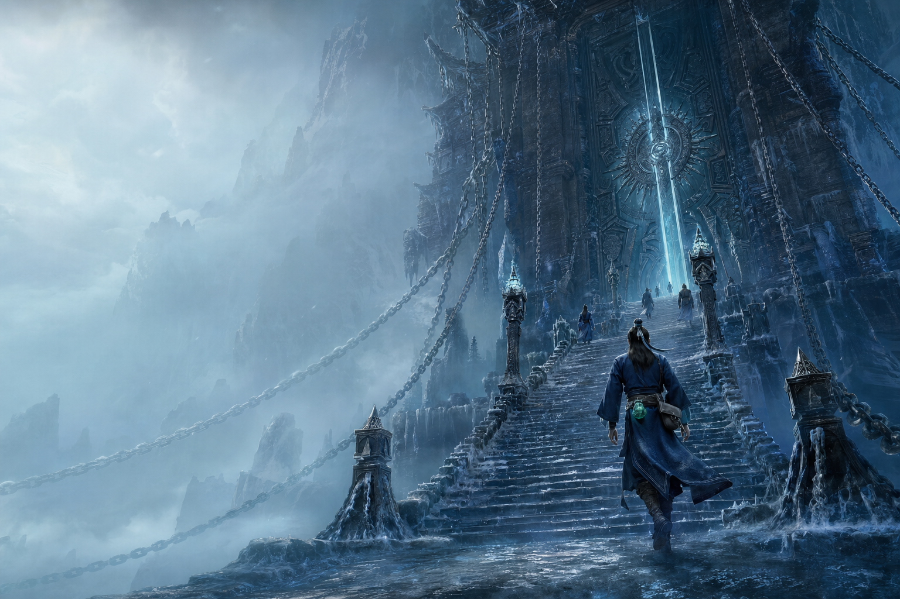

# Awesome Codex Theme

An open Codex Native theme pack standard, Registry, Validator, and Gallery.

[Browse 28 themes](https://rwang23.github.io/awesome-codex-theme/) · [中文 README](README.md) · [Theme pack standard](docs/standard.md) · [Fan Art policy](docs/fan-art-policy.md) · [Contributing](CONTRIBUTING.md)



## More than a background switcher

A CSS injection demo can look convincing while leaving important questions unanswered. Can the artwork be redistributed? Does the package contain executable code? How can an import be checked for tampering? Which theme fields can the current Codex desktop app accept natively?

Awesome Codex Theme puts those answers into one public contract:

- A shared manifest Schema describes identity, assets, modes, provenance, and compatibility.
- A canonical `.act-theme` contains declarative configuration and images only.
- The Registry records SHA-256 hashes, byte counts, dimensions, rights statements, and the Native contract version.
- The Validator checks the package allowlist, hashes, image integrity, WCAG contrast, and duplicate Native palettes.
- Every mode exports a `codex-theme-v1:` string that Codex desktop can import.
- GitHub Pages provides cover browsing, filters, mode switching, copying, downloads, and a Windows companion installer.

The project targets Codex Native only. It no longer exports Dream Skin, HeiGe Skin Studio, or CodeDrobe formats, and it does not inject CSS. The native contract supports colors, contrast, fonts, a code theme, and semantic colors, but not background images. Repository illustrations remain cover art and are never applied as app backgrounds. The application views shown by the Gallery come from the separate Beta capture workflow.

## Collections

The repository contains 28 themes with 56 distinct light/dark Native palettes, 56 deterministic covers, and 56 real 1440×810 screenshots captured after importing every mode into the isolated ChatGPT Beta `26.707.3351.0` test bench. The Gallery prefers the real captures and keeps the covers as reviewed source/fallback artwork. Each capture is bound to its Native hash, app readback hash, exact package version, fixed fixture, and baseline restoration evidence. See [Codex Native testing and screenshots](docs/native-testing.md).

| Collection | Contents | Themes |
| --- | --- | ---: |
| Original Xianxia 01 | Four original worlds, each with cinematic and chibi variants | 8 |
| China City Atlas 01 | Beijing, Shanghai, Shenzhen, Guangzhou, Chengdu, Hangzhou, Chongqing, and Nanjing | 8 |
| Donghua Character Tributes 01 | Cinematic and chibi leads from four series | 8 |
| Donghua Memory Scenes 01 | Void Hall, wedding rescue, rain-alley confession, and the Three-Year Agreement | 4 |

Each source image is generated through an OpenAI image job. A human then reviews workspace safe areas, text, watermarks, logos, character identity, and the 16:9 crop. The repository keeps a compact provenance record with the prompt hash, model, job ID, and output hash. It never stores keys or raw responses containing base64 images.

The first two collections are first-party original artwork under CC0 1.0. The latter two are clearly disclosed unofficial AI fan art based on characters and scenes from *A Record of a Mortal's Journey to Immortality*, *Renegade Immortal*, *Sword of Coming*, and *Battle Through the Heavens*. They are offered for personal, non-commercial fan use only. No official stills, posters, logos, or promotional assets are used, and no license or endorsement is claimed. Underlying rights remain with their owners. See the [Fan Art policy](docs/fan-art-policy.md).

## Use a theme

Open the [Gallery](https://rwang23.github.io/awesome-codex-theme/), choose a theme and mode, then open the “Use in Codex” panel. Windows users can download the no-admin companion installer, extract it, and run `Launch ACT Installer.cmd`. The helper validates its bundled Registry, copies the selected `codex-theme-v1:` string, and opens the exact Stable or Beta package. You then confirm Import in ChatGPT under Settings > Appearance.

You can also copy and import the string manually. The browser and installer never patch WindowsApps, application files, private data, or conversations, and the installer deliberately leaves the final import to the user. Canonical theme packages remain declarative and contain no scripts, CSS, or remote resources. See [Codex Native compatibility](docs/adapters.md) for the exact boundary.

## Create a theme with Codex

The repository includes a project skill at:

```text
.codex/skills/create-codex-theme/
```

Open this repository in Codex and ask:

```text
Use $create-codex-theme to create an original Suzhou canal mist theme.
Keep the left workspace safe area quiet, add light and dark modes,
and run the full validation when it is ready.
```

The Skill covers the bilingual brief, the original/fan-art rights track, image jobs, source-art review, color tokens, catalog scaffolding, Registry generation, validation, and browser acceptance testing.

For original work, copy the [theme brief template](.codex/skills/create-codex-theme/assets/theme-brief.template.json). Explicit unofficial fan art uses the [fan-art brief template](.codex/skills/create-codex-theme/assets/fan-art-theme-brief.template.json). Then run:

```bash
node .codex/skills/create-codex-theme/scripts/scaffold-theme.mjs \
  --brief path/to/theme-brief.json
```

Add `--apply` after reviewing the dry run, then generate and validate:

```bash
npm run art:generate -- --ids=<theme-id>
npm run check
```

## Local development

Node.js 22 or newer is required. The project has no npm runtime or development dependencies.

```bash
npm run check
npm run serve
```

Key commands:

```bash
npm run art:generate
npm run generate
npm run generate:check
npm run validate
npm run installer:build
npm run installer:validate
npm run screenshots:probe
npm test
npm run build
```

## License and AI disclosure

Project code uses the MIT License. First-party AI-generated artwork is dedicated under CC0 1.0 to the extent applicable rights exist. Unofficial fan art uses `LicenseRef-ACT-Fan-Art-Notice`, declares `rightsVerified: false`, prohibits commercial use, and links to the [Fan Art policy](docs/fan-art-policy.md). Every theme declares `aiGenerated: true` and keeps reviewable prompt and source hashes.

AI generation is not a copyright license and does not clear underlying character or franchise rights. Contributors remain responsible for inputs and for identifying any third-party characters, logos, signatures, or protected expression. See [NOTICE.md](NOTICE.md).
