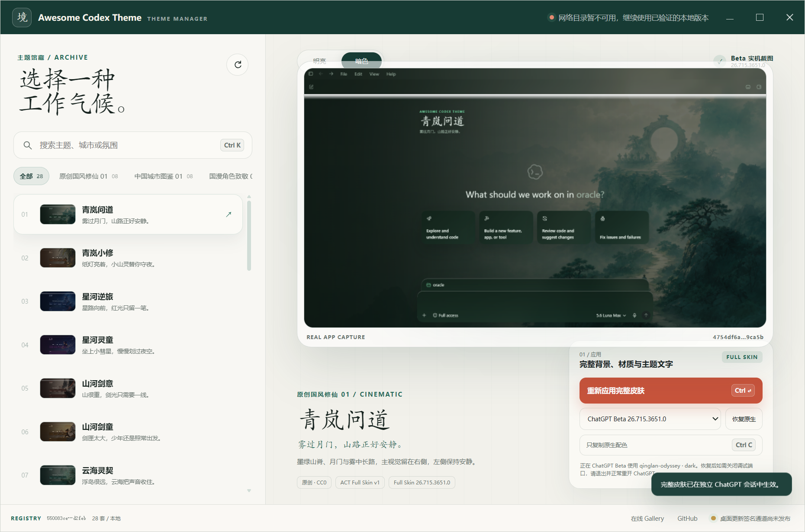

# Awesome Codex Theme

一个面向 Codex 桌面版的免费主题标准、Registry、Validator、Gallery 与跨平台主题管理器。

[在线 Gallery](https://rwang23.github.io/awesome-codex-theme/) · [English README](README.en.md) · [主题包标准](docs/standard.md) · [完整皮肤兼容说明](docs/adapters.md) · [Fan Art 说明](docs/fan-art-policy.md)



上图来自真实的 Tauri 2 Windows 应用。画面中的主题也不是效果图：它由独立 ChatGPT Beta `26.715.3651.0` 实际加载，截图后又完成了运行时清理。

## 现在安装的是一整套皮肤

Codex Native 主题只能更换配色。Awesome Codex Theme 的主要交付目标是 `ACT Full Skin v1`，它会同时应用：

- 2560×1440 背景图与构图焦点
- 明亮、暗色两套颜色 token
- 侧栏、建议卡片和输入框的半透明材质
- 主题名称与短文案
- 低动态模式

主题包仍然不带可执行代码。每个 `.act-theme` 只包含 manifest、两张图片和两份 Native 回退配色；CSS、注入逻辑和安全检查都属于开源 Theme Manager，主题作者不能随包附带脚本。

当前 v1 保留 Codex 原来的页面结构，不移动导航、输入框或业务组件。它可以做到完整背景和统一材质，但不会把 Codex 改造成另一套产品界面。这样做少一些戏剧性，版本升级后却更容易验证和恢复。

## 主题收藏

仓库现有 28 套主题、56 个明暗模式：

| 系列 | 内容 | 数量 |
| --- | --- | ---: |
| 原创国风修仙 01 | 4 个原创世界，每个世界有原画版和 Q 版 | 8 |
| 中国城市图鉴 01 | 北京、上海、深圳、广州、成都、杭州、重庆、南京 | 8 |
| 国漫角色致意 01 | 4 部作品的男女主原画版与 Q 版 | 8 |
| 国漫名场面 01 | 虚天殿、抢婚、雨巷告白、三年之约 | 4 |

全部 56 个模式都在独立 ChatGPT Beta `26.715.3651.0` 中生成了 1440×810 实机截图。Registry 会记录截图、背景图和运行时的 SHA-256、字节数、准确应用版本及选择器读回结果。Gallery 和 README 展示这些实机截图，不再拿一张源图冒充安装效果。

源图通过 OpenAI image job 生成，仓库保留 prompt 哈希、模型、job ID、源图哈希和人工审查结论，不保存 API 密钥或原始 base64 响应。

前两个系列是第一方原创素材，采用 CC0 1.0。后两个系列是明确披露的非官方 AI Fan Art，涉及《凡人修仙传》《仙逆》《剑来》和《斗破苍穹》。这些主题只面向个人、非商业的粉丝使用，不含官方截图、海报、Logo 或宣传素材，也不表示获得权利方授权。详情见 [Fan Art 政策](docs/fan-art-policy.md)。

## 如何使用

首选入口是 Tauri Theme Manager：

1. 关闭准备加载皮肤的 ChatGPT Stable 或 Beta。
2. 打开 Theme Manager，选择主题、明暗模式和目标应用。
3. 点击“应用完整皮肤”。
4. 管理器校验 Registry、背景图哈希、包身份和本机端口，再以仅限回环地址的调试参数启动准确的 ChatGPT 应用。
5. 需要恢复时点击“恢复原生”。退出并正常重开 ChatGPT 后，临时调试端口也会关闭。

如果目标 ChatGPT 已经由 Theme Manager 启动，后续切换主题不必反复关闭。若它正在普通模式运行，管理器会停止操作并提示先退出，不会强制结束用户会话。

Gallery 仍提供 `codex-theme-v1:` 字符串和 Windows 便携助手，作为只更换配色的轻量回退。它们不会安装背景。

## 安全边界

Full Skin 使用标准 Chromium DevTools Protocol 在当前会话中添加管理器自带的样式和运行时标记。连接只接受：

- `127.0.0.1` 或 `::1`
- 固定的 Stable/Beta 端口
- 与所选 Store 包完全一致的监听进程
- `app://` 页面目标

管理器不会写入 WindowsApps、`app.asar`、ChatGPT 私有数据或聊天内容，也不会执行主题包中的代码。下载的背景图必须同时匹配 Registry 中的路径、字节数和 SHA-256。恢复操作会移除当前样式以及为后续页面加载注册的脚本。

这不是 OpenAI 官方主题接口。Codex 升级可能改变页面选择器，所以兼容声明只绑定已测试版本；升级后要重新采集 56 张截图并通过 Validator。完整测试记录见 [Full Skin 测试与实机截图](docs/native-testing.md)。

## 为什么是 Tauri

Theme Manager 使用 Tauri 2、原生 HTML/CSS/JavaScript 和 Rust。Windows 与 macOS 共用界面和安装核心，不随应用打包 Chromium。Rust 负责 Registry 校验、图片缓存、包身份检查、CDP 连接、注入和恢复。

Windows 已完成：

- Rust 单元测试
- x64 release 构建和 NSIS 打包
- 真实 Theme Manager UI 的应用与恢复
- ChatGPT Beta 页面运行时读回
- 28 套主题、56 个模式的实机截图

macOS 的双架构 CI 路径已经准备好，但正式发布仍需要 Apple Developer 签名、公证和真机读回。Windows 正式安装包也需要代码签名。未签名构建不会被标成正式 Release。详见 [桌面主题管理器](docs/desktop-manager.md)。

## 用 Codex 创建新主题

项目自带 `.codex/skills/create-codex-theme/`。在仓库中可以直接说：

```text
使用 $create-codex-theme，为中国城市图鉴创建一套“苏州·运河晨雾”主题。
左侧保留工作区安全区，提供明暗模式，最后运行全部校验。
```

Skill 会生成 brief 和 image job 脚手架，检查原创性或 Fan Art 披露，配置安全区、明暗 token 与对比度，再更新 Registry。主题完成后还要在固定 Beta 中采集真实 Full Skin 截图。

## 本地开发

基础环境是 Node.js 22+。桌面开发还需要 Rust stable；Windows 需要 Microsoft C++ Build Tools，macOS 构建需要 Xcode Command Line Tools。

```bash
npm run generate
npm run validate
npm test
npm run build
```

常用命令：

```bash
npm run art:generate          # 通过 image job 生成源图
npm run generate              # 生成主题包、Registry、Full Skin 与 Native 记录
npm run generate:check        # 检查生成产物漂移
npm run validate              # 校验主题包、图片、截图和 Registry
npm run screenshots:capture   # 在固定 Beta 中采集 56 张 Full Skin 截图
npm run desktop:check         # Rust 格式检查与测试
npm run desktop:start         # 启动 Tauri Theme Manager
npm run desktop:build:win     # 构建 Windows NSIS
npm run desktop:build:mac     # 在 macOS 构建 DMG
```

仓库结构：

```text
.codex/skills/               项目级主题创作 Skill
apps/theme-manager/          Tauri 2 Theme Manager
packages/full-skin/          管理器自有的固定运行时
schemas/                     Theme Pack 与 Registry Schema
themes/catalog.json         人工维护的主题目录
themes/source-art/          image job、源图与 provenance
themes/registry.json        自动生成的公共 Registry
screenshots/                固定 Beta 实机截图与清单
scripts/                    生成、验证、截图和站点构建
site/                       无依赖 Gallery
```

`themes/<id>/`、`packages/*.act-theme`、`themes/registry.json` 和 `dist/` 是生成产物，不要手工修改。

## 授权与 AI 披露

项目代码采用 MIT。第一方 AI 原创素材在可适用的权利范围内采用 CC0 1.0。Fan Art 使用 `LicenseRef-ACT-Fan-Art-Notice`，标记 `rightsVerified: false` 并限制为非商业粉丝使用。

AI 生成不等于版权许可。贡献者仍需确认输入权利，并检查输出是否含有未披露的第三方角色、Logo、签名或受保护表达。完整说明见 [NOTICE.md](NOTICE.md)。
