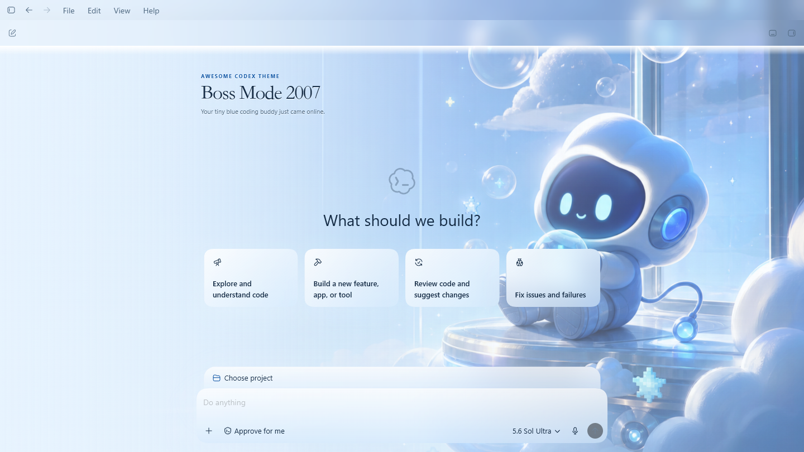
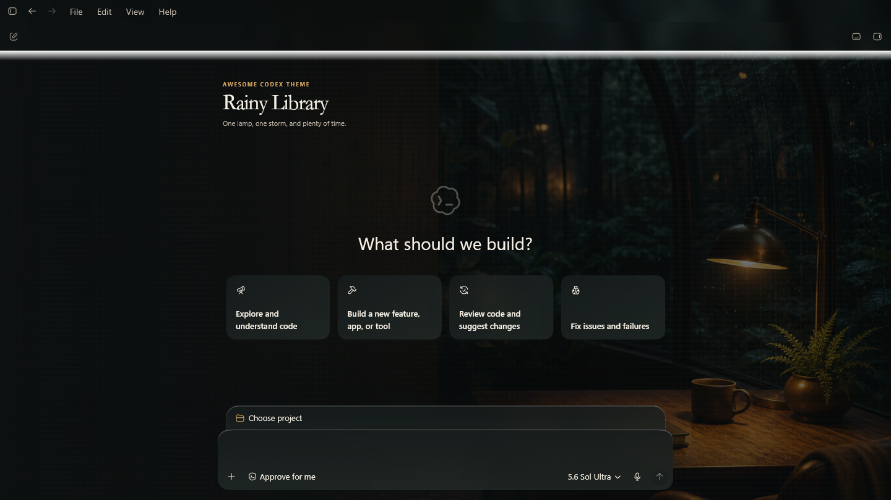

<h1 align="center">Awesome Codex Theme</h1>

<p align="center">
  Full visual skins for Codex Desktop, backed by real app captures and code-free theme packs.
</p>

<p align="center">
  <a href="https://rwang23.github.io/awesome-codex-theme/"><strong>Explore the Gallery</strong></a>
  ·
  <a href="https://github.com/rwang23/awesome-codex-theme/releases"><strong>Desktop Downloads</strong></a>
  ·
  <a href="https://community.ecomstack.net/"><strong>Theme Community</strong></a>
  ·
  <a href="docs/agent-install.md"><strong>Install with an Agent</strong></a>
  ·
  <a href="README.zh-CN.md"><strong>中文</strong></a>
</p>

<p align="center">
  <a href="LICENSE"></a>
  
  
  
</p>


The screenshot above comes from ChatGPT Beta `26.715.3651.0` after the skin was applied and read back from the live renderer. It is not a wallpaper pasted into an app mockup.

> Desktop builds are published only on the official [GitHub Releases page](https://github.com/rwang23/awesome-codex-theme/releases). If that page has no asset compatible with your operating system and CPU, there is no supported public installer for that target.

## More than a color palette

Awesome Codex Theme combines the parts that make a desktop skin feel complete:

- a 2560×1440 background with a declared focal point and quiet work area;
- separate light and dark color systems;
- translucent materials for the sidebar, cards, and composer;
- localized theme names and short copy;
- reduced-motion support;
- a Native palette fallback when a full background cannot be applied.

Theme packs are declarative and contain no executable code. A `.act-theme` archive carries a manifest, verified images, and Native fallback palettes. The open-source Theme Manager owns the CSS runtime, process checks, image verification, application, and cleanup.

Version 1 preserves the original Codex layout and controls. It changes the atmosphere without replacing navigation, moving the composer, or turning the app into a screenshot.

## See the real result

| Saint Tibo<br>God of Reset | Boss Mode 2007 |
| --- | --- |
|  |  |
| **Rainy Library** | **Orbital Dawn** |
|  |  |

The collection currently includes 53 themes and 106 light/dark modes. The English experience highlights:

- 12 original World City themes spanning New York, San Francisco, Chicago, Toronto, Vancouver, London, Paris, Berlin, Rome, Tokyo, Singapore, and Sydney;
- 6 original global workspace themes, from a rainy library to an orbital sunrise;
- 1 original 2007 desktop-nostalgia theme with a new, non-franchise chibi mascot;
- 2 disclosed, unofficial Codex community tributes;
- the broader original and fan-art catalog, available through language-aware discovery in the Gallery.

Every mode has a 1440×810 capture from the pinned Beta test bench. Registry records bind each capture to the exact app version, background hash, runtime hash, byte count, and renderer readback.

“Saint Tibo” is an affectionate, unofficial community parody. It is not endorsed by OpenAI or by the person depicted, and no official product artwork is bundled.

[Browse all themes in the Gallery](https://rwang23.github.io/awesome-codex-theme/)

## Get started

Choose one of the following three methods. They are alternatives, not sequential setup steps.

### Method A — Install the desktop app (recommended)

1. Download the build for your operating system and CPU from [GitHub Releases](https://github.com/rwang23/awesome-codex-theme/releases).
2. Quit the ChatGPT Stable or Beta app you want to theme.
3. Open Theme Manager and choose a theme, light or dark mode, and the exact target app.
4. Select **Apply Full Skin**.
5. On Windows, optionally enable **Always apply this theme** for future verified launches.
6. Select **Restore Native** whenever you want the original interface back. This also turns off Always apply.

The Windows implementation of **Always apply** has passed an exact ChatGPT Beta `26.715.3651.0` persistence and cleanup smoke test. It stores a user-level choice and safely replays the verified Full Skin on future launches; it never patches ChatGPT files. Unknown versions stay native. Physical-Mac persistence testing is still pending, so the macOS build must not yet be treated as verified for this feature. See [Keep My Theme On](docs/persistent-theme.md).

Theme updates and app updates are independent. The manager refreshes the verified Registry on startup, so newly published themes appear immediately without reinstalling or restarting the app. A signed app update is needed only when the manager itself changes—for example its runtime, compatibility rules, security boundary, platform integration, or interface.

The public beta uses Tauri updater signatures so future app updates can be verified. macOS bundles also carry an ad-hoc signature for package integrity, but Windows Authenticode, Apple Developer ID, and notarization are deferred. The operating system may still show an unknown-publisher warning; neither the updater signature nor the ad-hoc Mac signature removes SmartScreen or Gatekeeper warnings. See [release trust and signing](docs/release-signing.md).

### Method B — Ask a coding agent

Copy the following request into Codex, Claude Code, or another local coding agent:

```text
Install Awesome Codex Theme Manager from the official repository:
https://github.com/rwang23/awesome-codex-theme

Detect my operating system and CPU architecture. Use only an installer published
by rwang23 on the official GitHub Releases page. Do not modify WindowsApps,
ChatGPT.app, app.asar, private app data, or conversations. Do not bypass an
operating-system security warning or close a running ChatGPT/Codex session
without asking me first. If no compatible release exists, stop and tell me
instead of building or downloading from another source.
```

The complete agent contract, including expected checks and source-build instructions, is in [docs/agent-install.md](docs/agent-install.md).

### Method C — Build from source

For contributors, the base requirement is Node.js 22+. Desktop builds also need stable Rust and the platform toolchain.

```bash
npm run generate
npm run validate
npm test
npm run build
```

## Safe by design

Full Skin uses a loopback-only Chromium DevTools Protocol session. Theme
Manager asks the operating system for an available local port, then accepts the
listener only when it belongs to the exact selected Stable or Beta package and
exposes an `app://` renderer target.

It does not:

- write to WindowsApps, `ChatGPT.app`, or `app.asar`;
- read or modify conversations;
- execute code from a theme pack;
- trust an image whose path, size, PNG signature, and SHA-256 do not match the Registry;
- silently close a normally running ChatGPT session.

This is not an official OpenAI theme API. Codex updates can change internal selectors, so compatibility is tied to tested app versions. A new version must pass the validator, apply/restore checks, and real capture run before it is marked compatible.

## Create a theme with Codex

The repository includes the project-local `$create-codex-theme` Skill. From a checkout, ask:

```text
Use $create-codex-theme to add an original "Suzhou Canal Mist" theme.
Keep the left work area quiet, provide light and dark modes, and run every check.
```

The Skill prepares an art brief and image job, checks original or fan-art disclosure, configures safe areas and contrast, updates the Registry, and guides the real-app capture step.

## Join the community

The hosted [Codex Theme Community](https://community.ecomstack.net/) is now available as a public beta. It supports accounts, code-free `.act-theme` uploads, server-side package validation, a quarantine and moderation queue, and one vote per account per theme.

Community approval and votes do not publish a theme into the official Registry. Promotion still requires:

- a [structured GitHub proposal](https://github.com/rwang23/awesome-codex-theme/issues/new?template=theme-proposal.yml) or reviewed Pull Request;
- rights and provenance review;
- repository Validator and CI checks;
- apply, capture, and restore evidence from a pinned Codex build.

The hosted service is intentionally separate from this open-source runtime repository. See [community platform architecture](docs/community-platform.md) and the [Registry promotion route](docs/community-registry.md).

## Project map

<details>
<summary>Repository layout and developer commands</summary>

```text
.codex/skills/               Theme creation Skill
apps/theme-manager/          Tauri 2 Theme Manager
packages/full-skin/          Reviewed, manager-owned runtime
schemas/                     Theme Pack and Registry schemas
themes/catalog.json          Hand-maintained theme catalog
themes/source-art/           Image jobs, source art, and provenance
themes/registry.json         Generated public Registry
screenshots/                 Version-pinned real app captures
scripts/                     Build, validation, capture, and site tooling
site/                        Dependency-free Gallery
```

Useful commands:

```bash
npm run art:generate
npm run generate
npm run generate:check
npm run validate
npm run screenshots:capture
npm run desktop:check
npm run desktop:start
npm run desktop:build:win
npm run desktop:build:mac
```

Generated theme directories, `.act-theme` archives, the Registry, and `dist/` should not be edited by hand.

</details>

## License and artwork

Project code is MIT. First-party AI-generated artwork is released under CC0 1.0 where applicable. Fan art uses `LicenseRef-ACT-Fan-Art-Notice`, sets `rightsVerified: false`, and is limited to personal, non-commercial fan use.

AI generation does not clear copyright, character, likeness, trademark, or source-asset rights. Contributors must review every input and output. See [NOTICE.md](NOTICE.md) and the [Fan Art policy](docs/fan-art-policy.md).

If this project gives your coding workspace a little more personality, [star the repository](https://github.com/rwang23/awesome-codex-theme) and share a privacy-safe screenshot.
