<h1 align="center">Awesome Codex Theme</h1>

<p align="center">
  面向 Codex 桌面版的完整视觉皮肤。主题包不带代码，展示图来自真实应用。
</p>

<p align="center">
  <a href="https://rwang23.github.io/awesome-codex-theme/"><strong>浏览主题 Gallery</strong></a>
  ·
  <a href="docs/agent-install.md"><strong>让 Agent 帮你安装</strong></a>
  ·
  <a href="https://community.ecomstack.net/"><strong>主题社区</strong></a>
  ·
  <a href="https://github.com/rwang23/awesome-codex-theme/releases"><strong>下载桌面应用</strong></a>
  ·
  <a href="README.md"><strong>English</strong></a>
</p>

<p align="center">
  <a href="LICENSE"></a>
  
  
  
</p>

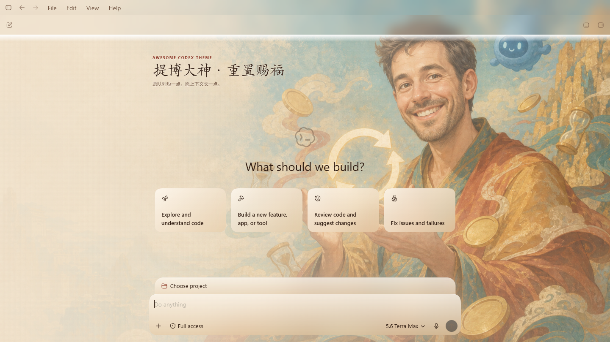

上图来自 ChatGPT Beta `26.715.3651.0`：皮肤真正应用到页面并完成运行时读回后才截图，不是把壁纸贴进应用效果图。

> 桌面安装包只会发布在官方 [GitHub Releases 页面](https://github.com/rwang23/awesome-codex-theme/releases)。如果页面上没有与你的操作系统和 CPU 匹配的文件，就表示当前没有支持该目标的公开安装包。

## 它不只是换一组颜色

Awesome Codex Theme 会把一套皮肤需要的部分一起应用：

- 带焦点位置与工作安全区的 2560×1440 背景；
- 独立的明亮、暗色配色；
- 侧栏、卡片和输入框的半透明材质；
- 中英文主题名称与短文案；
- 低动态模式；
- 无法应用完整背景时可用的 Native 配色回退。

主题包采用声明式格式，不包含可执行代码。一个 `.act-theme` 文件只携带 manifest、经过验证的图片和 Native 回退配色。CSS 运行时、进程识别、图片校验、应用与清理都由开源 Theme Manager 负责。

第一版保留 Codex 原有布局与控件。它会改变整个工作区的氛围，但不会移动导航、替换输入框，也不会用一张假截图覆盖真实界面。

## 开始使用

下面三种方式任选其一即可，它们不是必须依次完成的三个步骤。

### 方式 A：让 Coding Agent 帮你安装（推荐）

把下面的内容复制给 Codex、Claude Code 或其他本机 coding agent：

```text
请从 Awesome Codex Theme 的官方仓库安装 Theme Manager：
https://github.com/rwang23/awesome-codex-theme

先识别我的操作系统和 CPU 架构，只能使用 rwang23 在官方 GitHub Releases
发布的安装包。不要修改 WindowsApps、ChatGPT.app、app.asar、应用私有数据或
聊天内容。不要擅自绕过系统安全提示，也不要在没有征得我同意时关闭正在运行的
ChatGPT/Codex。如果当前没有兼容的 Release，请停止并告诉我，不要从其他来源
下载，也不要自行从源码构建。
```

完整 Agent 契约、核对清单与源码构建提示见 [docs/agent-install.md](docs/agent-install.md)。

### 方式 B：从源码构建

贡献者需要 Node.js 22+。桌面构建还需要 Rust stable 和对应平台的构建工具。

```bash
npm run generate
npm run validate
npm test
npm run build
```

### 方式 C：手动安装桌面应用

1. 从 [GitHub Releases](https://github.com/rwang23/awesome-codex-theme/releases) 下载与你的系统和 CPU 匹配的版本。
2. 完全退出准备加载皮肤的 ChatGPT Stable 或 Beta。
3. 打开 Theme Manager，选择主题、明暗模式和准确的目标应用。
4. 点击“应用并保持完整皮肤”，并确认首次常驻提示。
5. 以后每次打开这个已验证的 ChatGPT 目标时，主题都会自动恢复；之后再次“应用并保持”会替换已保存的主题。
6. 想回到原生界面时，点击“恢复原生”。这也会关闭常驻。

Windows 版“应用并保持完整皮肤”已经通过 ChatGPT Beta `26.715.3651.0` 的准确版本常驻与清理闭环测试。首次确认后，它保存当前用户级选择，并在以后打开已验证版本时安全重放 Full Skin，不会修改 ChatGPT 文件；未知版本会保持原生界面。macOS 仍缺少真机常驻闭环，暂时不能把这项能力视为已在 Mac 验证。详见[主题常驻方案](docs/persistent-theme.md)。

主题更新与应用更新彼此独立。管理器启动时会刷新经过验证的 Registry，所以新发布的主题无需重装或重启应用就会直接出现。只有管理器自身的运行时、兼容规则、安全边界、平台集成或界面发生变化时，才需要安装签名应用更新。

公开 Beta 使用 Tauri updater 签名来验证以后收到的应用更新；macOS 应用包还带有只用于包完整性的 ad-hoc 签名。Windows Authenticode、Apple Developer ID 与公证暂时延后，所以系统仍可能显示未知发布者提示。Updater 与 ad-hoc 签名都不能消除 SmartScreen 或 Gatekeeper 提示，详见[发布信任与签名](docs/release-signing.md)。

## 真实使用效果

[**先在 Gallery 浏览全部 68 套主题 →**](https://rwang23.github.io/awesome-codex-theme/)

下面的实机图覆盖当前每一个系列。第一张保留提博大神的暗色 Reset 效果；其余全部使用明亮模式，让工作区细节更容易看清。

| Codex 社区致意 01 | 国风修仙 01 |
| --- | --- |
| **提博圣像 · 重置之神** | **青岚小修 · Q 版修仙** |
| 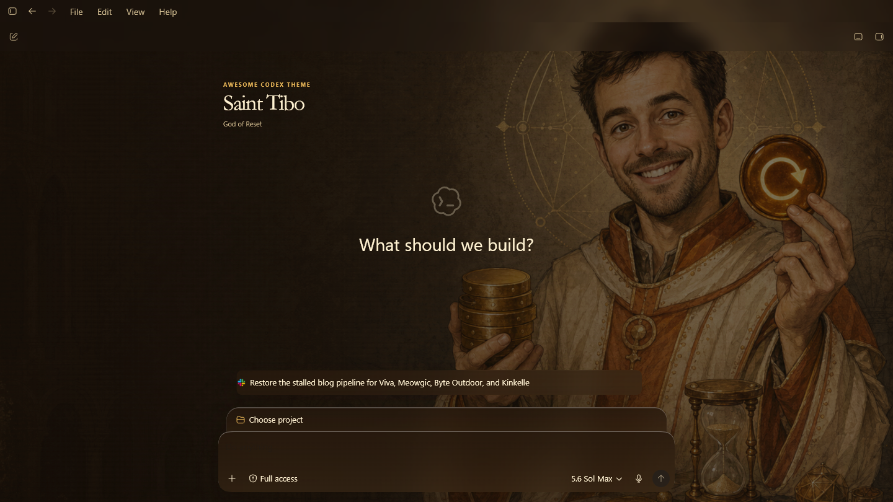 | 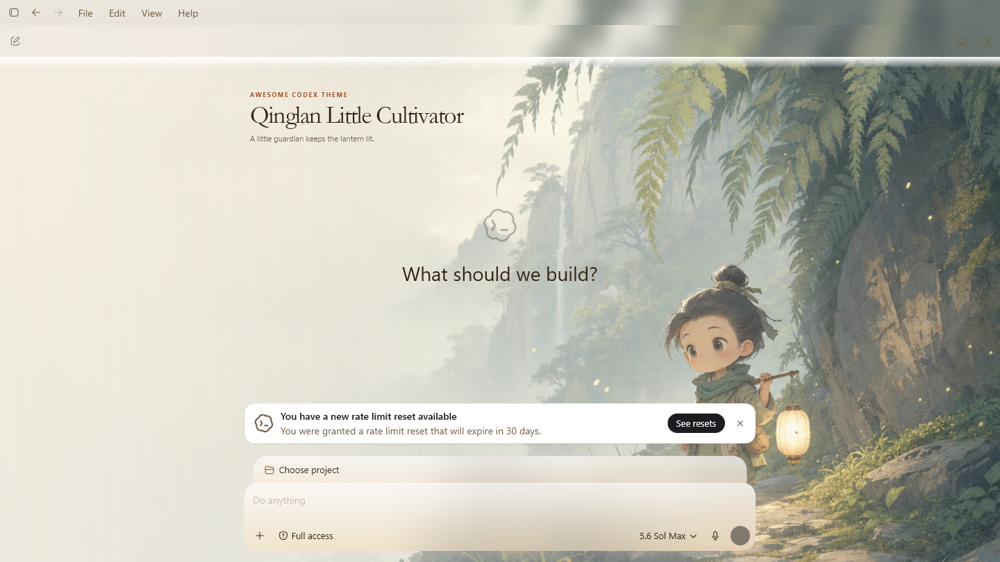 |
| 中国城市图鉴 01 | 国漫角色致敬 01 |
| **北京·城轴晨光** | **凡人·道侣相望** |
| 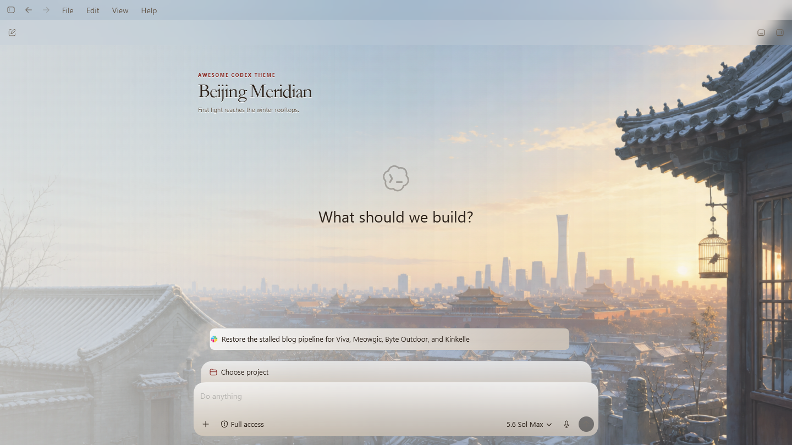 | 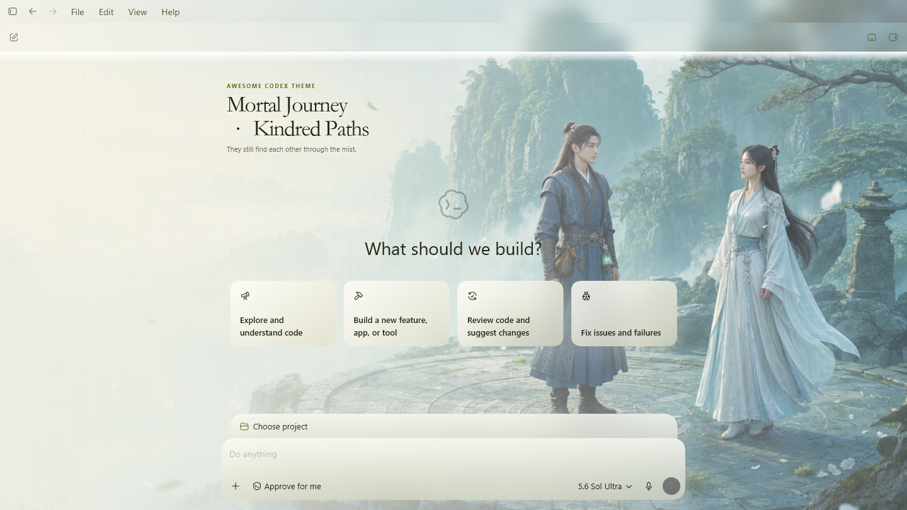 |
| 国漫名场面 01 | 凡人修仙传·秘境小集 |
| **凡人·虚天殿** | **凡人·药圃灯影** |
| 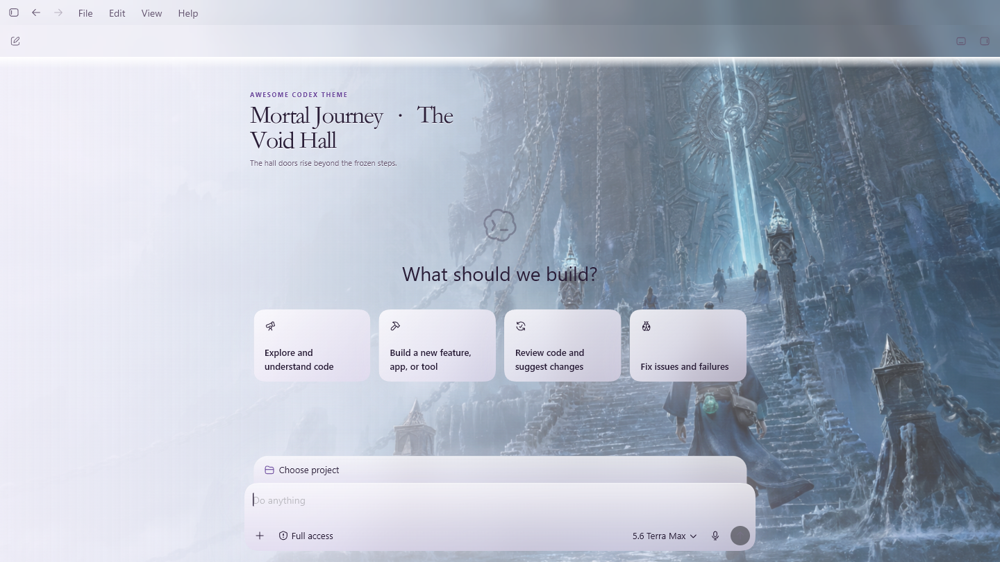 | 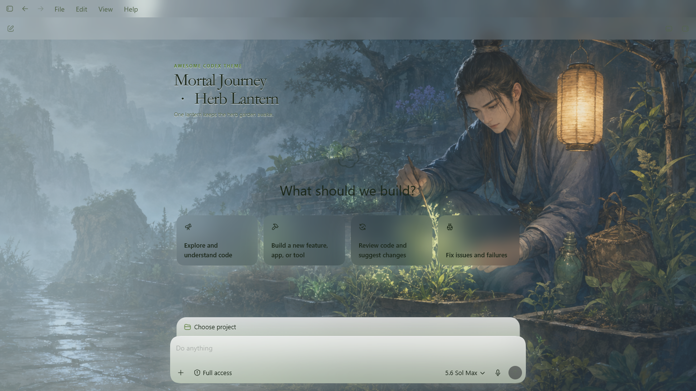 |
| 原创修仙 02 | 中国生活诗意 01 |
| **玉简晨阁** | **江南·雨落小院** |
| 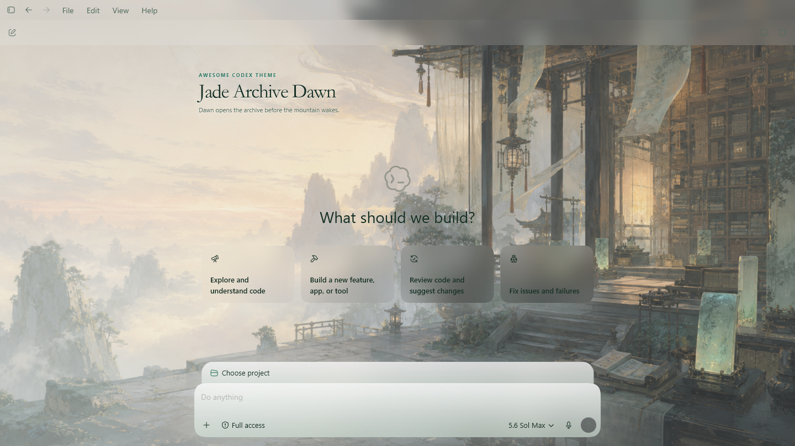 | 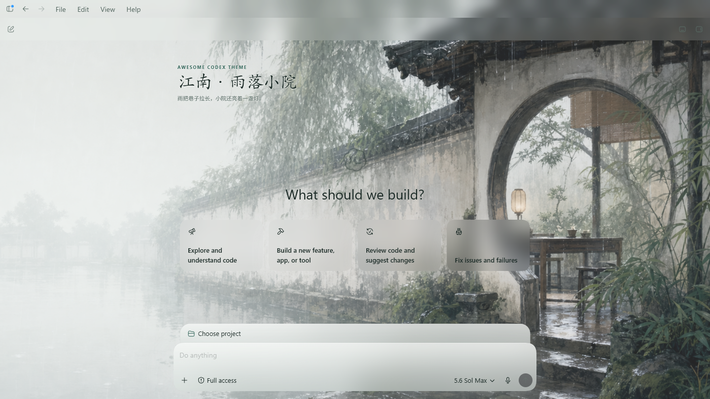 |
| 世界城市图鉴 01 | 全球工作区灵感 01 |
| **纽约·雨落曼哈顿** | **轨道黎明** |
| 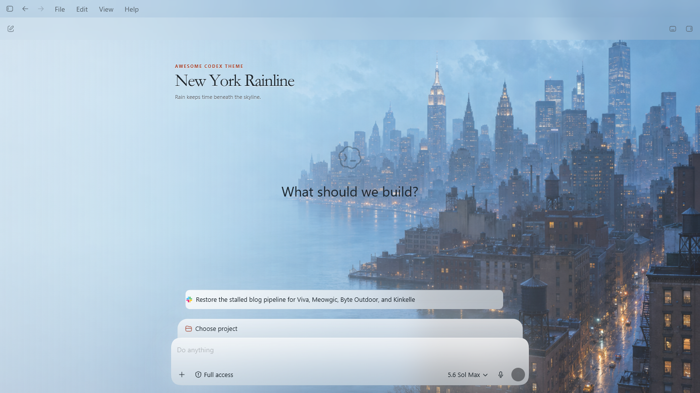 | 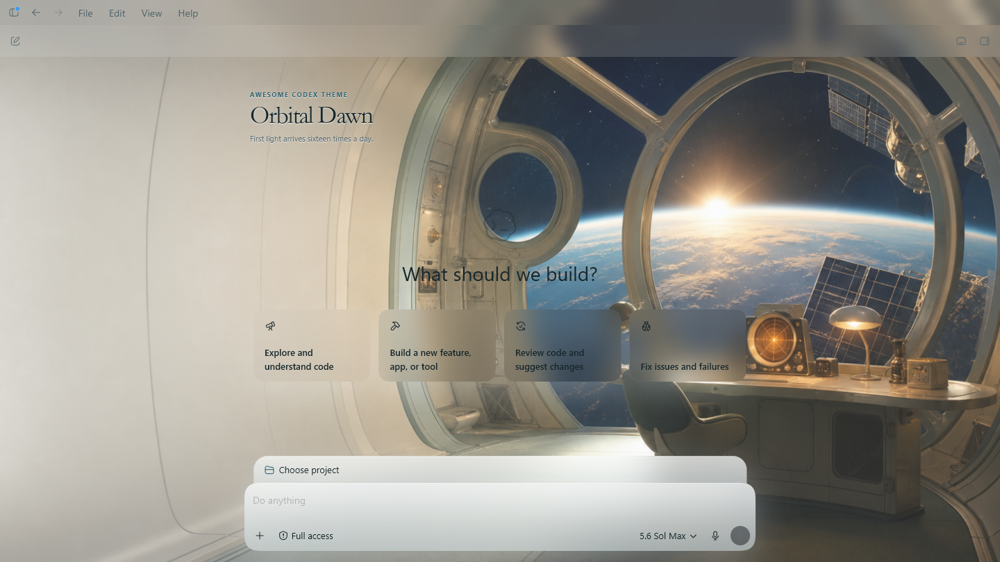 |
| 美式工作区灵感 02 | 凡人修仙传·秘境小集 |
| **海岸工作室晨光** | **凡人·雨夜符火** |
| 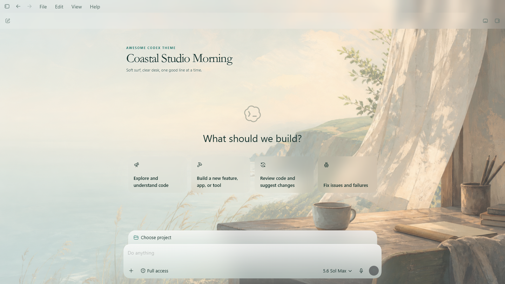 | 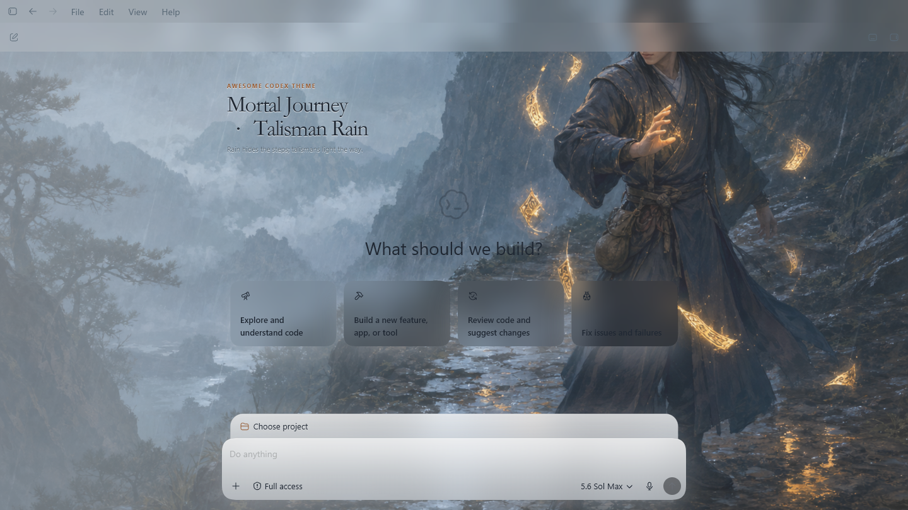 |

目前共有 68 套主题、136 个明暗模式。中文体验会优先展示：

- 8 套国风修仙主题，包含原画版与 Q 版；
- 8 套原创中国城市图鉴；
- 12 套覆盖北美、欧洲与亚太的原创世界城市图鉴；
- 8 套明确披露的非官方国漫角色致意；
- 4 套明确披露的非官方国漫记忆场景；
- 5 套面向中文用户创作的山河与生活主题；
- 5 套原创修仙意境主题，包括玉简晨阁、萤河渡口和云锻静室；
- 5 套明确披露、非官方、非商业使用的《凡人修仙传》灵感场景；
- 5 套面向美国工作场景的原创主题，包括海岸工作室和深夜餐馆；
- 1 套 2007 桌面怀旧 Q 版主题，以及 2 套 Codex 社区致意主题。

每个模式都有固定 Beta 测试台生成的 1440×810 实机截图。Registry 会把截图与准确应用版本、背景哈希、运行时哈希、字节数和页面读回结果绑定。

“提博大神”是社区表达喜爱的非官方戏仿与致意，不代表 OpenAI 或被描绘者背书，也不包含官方产品素材。

## 安全边界

Full Skin 通过仅限本机回环的 Chromium DevTools Protocol 会话工作。Theme
Manager 会先向系统申请一个可用的本机端口，再确认监听确实属于所选的 Stable 或
Beta 包，并且只连接 `app://` 页面目标。

它不会：

- 写入 WindowsApps、`ChatGPT.app` 或 `app.asar`；
- 读取或修改聊天内容；
- 执行主题包中的代码；
- 信任路径、大小、PNG 文件头或 SHA-256 与 Registry 不一致的图片；
- 静默关闭一个正常运行的 ChatGPT 会话。

这不是 OpenAI 官方主题接口。Codex 更新可能改变内部选择器，因此兼容声明只针对经过测试的应用版本。新版本必须重新通过 Validator、应用与恢复检查和实机截图流程。

## 用 Codex 创建主题

仓库内置项目级 `$create-codex-theme` Skill。在本地仓库中可以直接说：

```text
使用 $create-codex-theme，创建一套原创“苏州·运河晨雾”主题。
左侧保留安静的工作区，提供明暗模式，并运行全部检查。
```

Skill 会准备美术 brief 和 image job，检查原创或 Fan Art 披露，配置安全区与对比度，更新 Registry，并引导完成真实应用截图。

## 加入社区

公开 Beta 版 [Codex Theme Community](https://community.ecomstack.net/) 已经上线。它支持账号、无代码 `.act-theme` 上传、服务端主题包校验、隔离审核队列，以及每个账号对每套主题一票。

社区审核通过或票数领先，都不会自动把主题写入官方 Registry。正式收录仍然需要：

- [结构化 GitHub 提案](https://github.com/rwang23/awesome-codex-theme/issues/new?template=theme-proposal.yml)或经过审查的 Pull Request；
- 素材权利与来源审查；
- 仓库 Validator 与 CI；
- 在固定 Codex 版本中完成应用、截图和恢复证据。

社区服务与这个开源运行时仓库保持独立。完整边界见[社区平台架构](docs/community-platform.md)与[Registry 收录路线](docs/community-registry.md)。

## 项目结构

<details>
<summary>仓库目录与开发命令</summary>

```text
.codex/skills/               主题创作 Skill
apps/theme-manager/          Tauri 2 Theme Manager
packages/full-skin/          由管理器维护的固定运行时
schemas/                     Theme Pack 与 Registry Schema
themes/catalog.json          人工维护的主题目录
themes/source-art/           image job、源图与 provenance
themes/registry.json         自动生成的公共 Registry
screenshots/                 绑定版本的真实应用截图
scripts/                     构建、校验、截图与站点工具
site/                        无依赖 Gallery
```

常用命令：

```bash
npm run art:generate
npm run generate
npm run generate:check
npm run validate
npm run screenshots:capture
npm run desktop:check
npm run desktop:start
npm run desktop:build:win
npm run desktop:build:mac
```

自动生成的主题目录、`.act-theme`、Registry 和 `dist/` 不应手工修改。

</details>

## 授权与素材

项目代码采用 MIT。第一方 AI 原创素材在适用范围内采用 CC0 1.0。Fan Art 使用 `LicenseRef-ACT-Fan-Art-Notice`，设置 `rightsVerified: false`，并仅限个人、非商业的粉丝使用。

AI 生成不会自动解决版权、角色、肖像、商标或来源素材权利。贡献者仍需检查每个输入和输出。详见 [NOTICE.md](NOTICE.md) 与 [Fan Art 政策](docs/fan-art-policy.md)。

如果它让你的工作区更像自己的空间，欢迎[给仓库点一个 Star](https://github.com/rwang23/awesome-codex-theme)，再分享一张不含隐私的实机截图。
